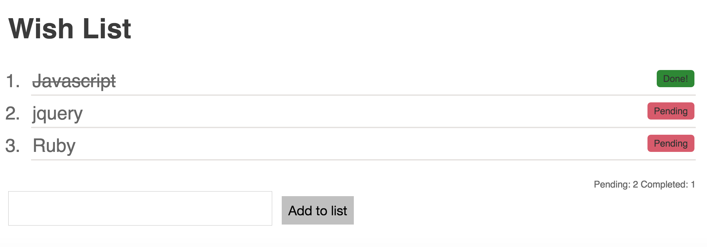

# Wishlist
A todo list written in Javascript and jQuery.

Items can be added to the list with a pending button. When the button is clicked, it will change into a done button with a strikethrough applied to the item.

There is a responsive total count that lists the pending and done items.

This was from a Codebar tutorial in preperation for coaching there.

## Screenshots

  

